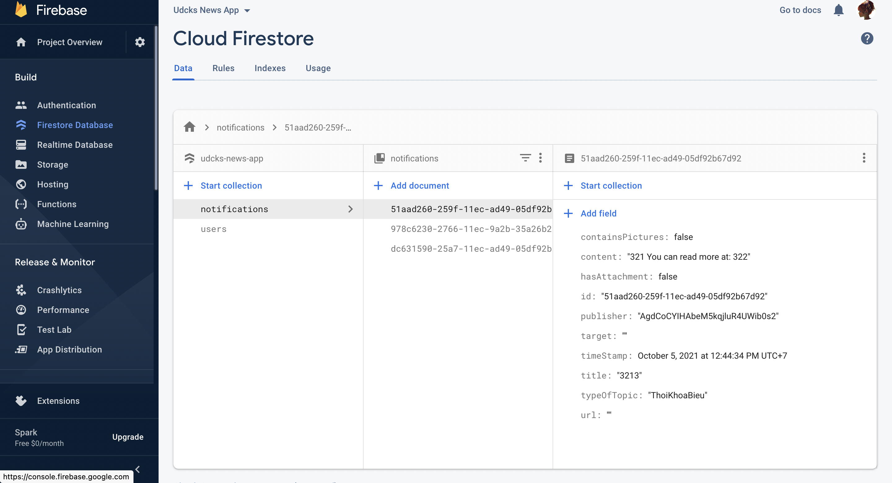

# DEMO ỨNG DỤNG

## Icon của ứng dụng

{width="3.405492125984252in"
height="5.788490813648294in"}

Hình 1: Icon ứng dụng

Ứng dụng sẽ lấy icon là logo của trường và tên của ứng dụng là tên viết
tắt của trường UDCK

## Giao diện splash screen

{width="3.3214468503937007in"
height="7.198113517060367in"}

Hình 2: Màn hình splash

## Giao diện đăng nhập ứng dụng

{width="6.295138888888889in"
height="5.257638888888889in"}

Hình 3: Màn hình đăng nhập, đăng kí

Tại màn hình này, bạn sẽ đăng nhập, và đăng kí

{width="5.998009623797025in"
height="3.277898075240595in"}

Hình 4: Dữ liệu của người dùng khi đăng kí

### Giao diện chào mừng cho lần đầu đăng nhập

{width="6.295138888888889in"
height="2.65in"}

Hình 5: Màn hình cho chào mừng

Đây là màn hình chào mừng của chương trình, màn hình sẽ được hiển thị
khi tài khoản lần đầu đăng nhập vào hệ thống. Và tại đây tài khoản của
người dùng sẽ được khởi tạo trên dữ liệu đám mây Firestore

## Giao diện chính của ứng dụng

{width="3.634004811898513in"
height="7.875477909011374in"}

Hình 6: Màn hình chính, cho phép xem thông báo

Đây là màn hình chính của ứng dụng, nó hiển thị các thông báo đến các
người dùng. Nút nhỏ màu xám bên phải ở dưới là chức năng gửi thông báo.
Ở trên thể hiện các tin nhắn đến người dùng, các tin nhắn sẽ hiển thị
người gửi, ảnh đại diện của người gửi, title và nội dung của thông báo.

## Giao diện gửi thông báo

{width="6.295138888888889in"
height="8.874305555555555in"}

Hình 7: Màn hình gửi thông báo

Màn hình gửi thông báo. Màn hình sẽ chia thành các bước nhỏ, mỗi bước có
nội dung riêng và có các controller riêng. Sau khi đăng nhập dữ liệu,
người dùng sẽ được thấy preview về thông báo mà mình sẽ gửi để có thể
chỉnh sửa

Sau khi nhấn gửi, ứng dụng sẽ đẩy dữ liệu lên FireStore. Sau đó, ứng
dụng sẽ thực hiện một Request đến FCM và gửi thông báo đến các thiết bị
có kết nối.

{width="6.295138888888889in"
height="3.4145833333333333in"}

Hình 8: Dữ liệu sau khi được đẩy lên Firebase

{width="4.342125984251968in"
height="7.719101049868766in"}

Hình 9: Màn hình thông báo

## Giao diện user

{width="3.8988757655293087in"
height="8.449496937882765in"}

Hình 10: Màn hình User

Màn hình hiển thị thông tin người dùng, có thể đăng xuất khi nhấn nút
"Logout" và chỉnh sửa dữ liệu của người dùng.

## Giao diện trang web Udck

{width="4.269663167104112in"
height="7.5902810586176725in"}

Hình 11: Giao diện truy cập trang web UDCK

Giao diện hiển thị trang web UDCK trên ứng dụng. Người dùng sẽ sử dụng
chức năng này nếu muốn tìm hiểu thêm thông tin cũng như bài viết của nhà
trường

## Giao diện chọn đối tượng để nhận thông báo

{width="3.752808398950131in"
height="8.132945100612423in"}

Hình 12: Giao diện chọn đăng kí đối tượng để nhận thông tin

Giao diện cho phép người dùng chọn các đối tượng mà người dùng muốn nhận
thông báo. Sau khi nhấn Save, dữ liệu cá nhân sẽ được lưu trữ và đồng
bộ.

## Giao diện xem chi tiết thông báo

{width="3.800340113735783in"
height="8.23595472440945in"}

Hình 13: Giao diện thông báo cá nhân

Đây là chức năng xem chi tiết thông báo, người dùng có thể gửi tin nhắn
cũng như thảo luận
